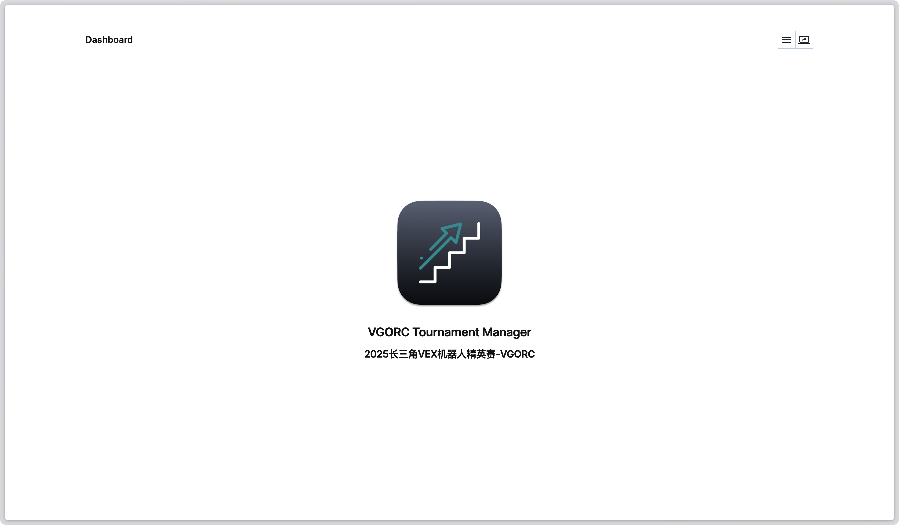
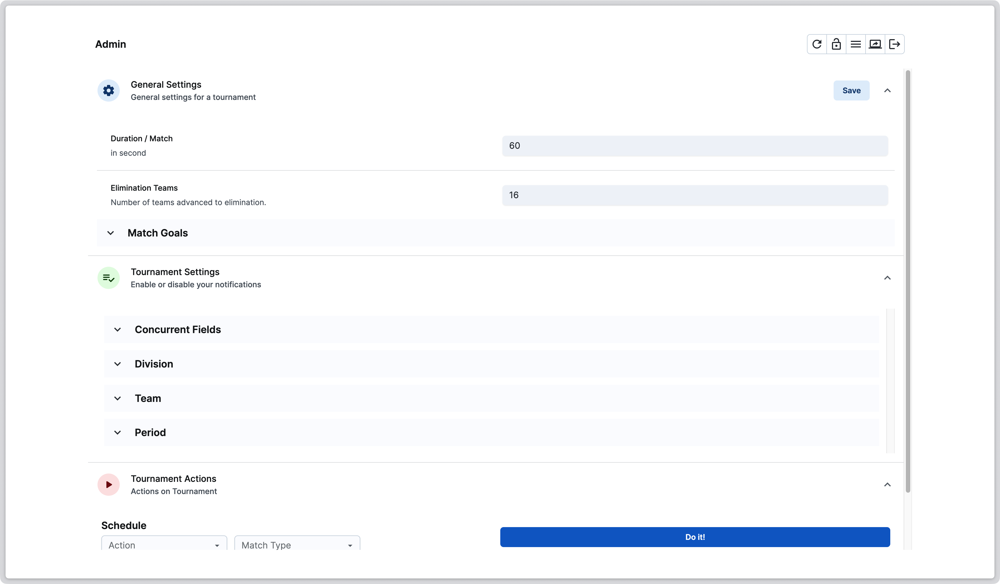
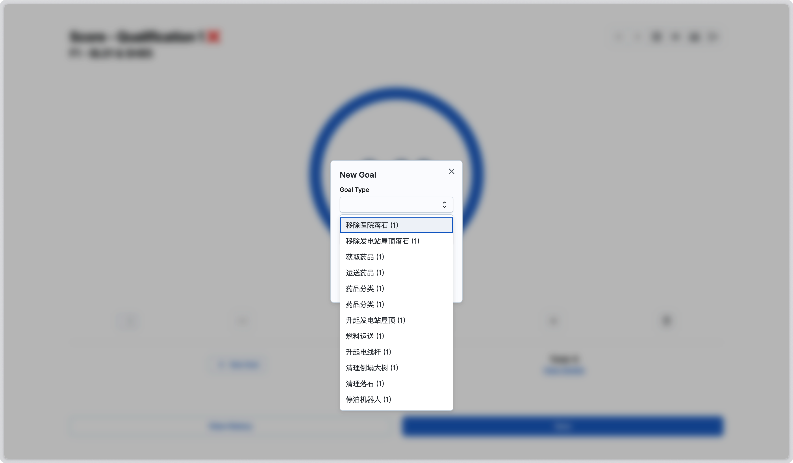
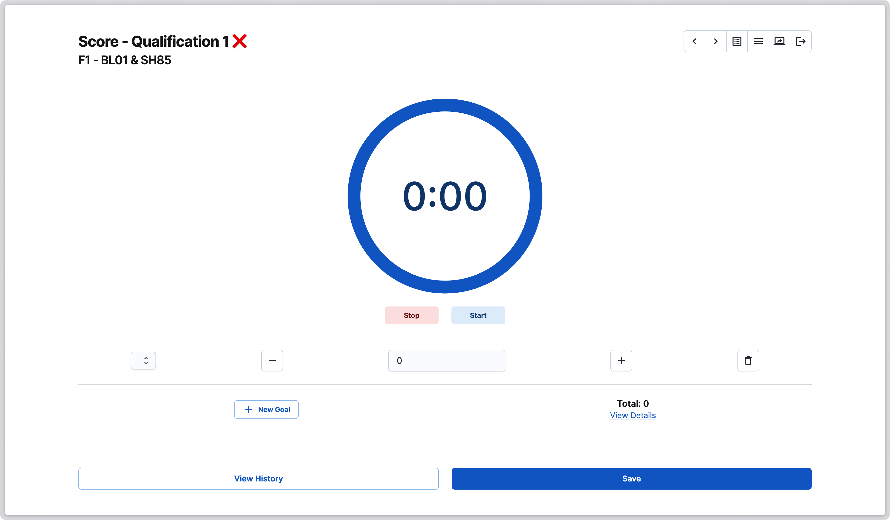
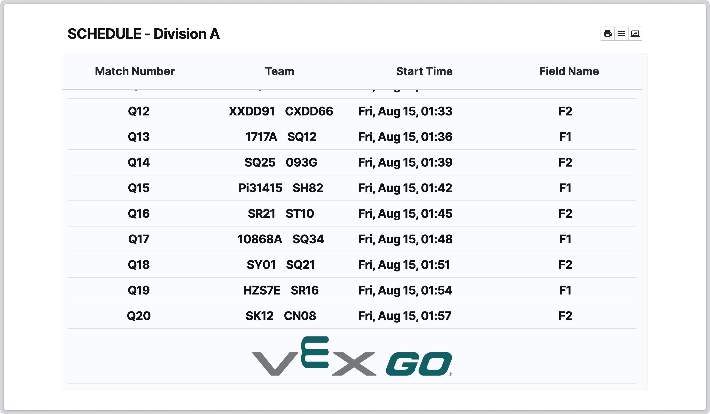
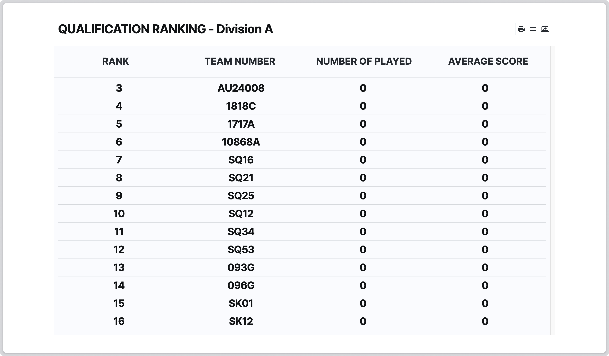

<p align="center">
  <a href="./frontend/public/TM.png">
    
  </a>
</p>

<h3 align="center">VGORC Tournament Manager</h3>
<h4 align="center">Createch Intelligence</h3>

## 代码许可

本项目采用Apache-2.0开源许可，详情请查看[LICENSE](./LICENSE)文件

## 功能介绍

- 适用于VEX GO Robotics Competition的赛事管理系统
- 全平台兼容
- 支持队伍管理、分区管理、对阵表生成、技能赛、比赛计时、比赛成绩录入
- 支持排名表生成、成绩发布、Grafana 云发布等功能
- 自定义赞助商列表
- 自动数据库备份
- [树莓派投屏](https://github.com/CreatechStudio/VGORC-TM-DisplayOS)

> [!IMPORTANT]  
> 本程序为非官方赛事管理系统，与REC Foundation或任何Event Partner无关。
> 本程序尽可能的还原并优化了[VEX Tournament Manager](https://vextm.dwabtech.com)里的功能，但并不保证完全一致。

## 使用截屏

|                                  |                            |
|:--------------------------------:|:--------------------------:|
|          |  |
|                首页                |           管理员界面            |
|        ||
|              成绩录入界面              |         计时界面          |
|  ||
|          对阵表生成界面           |        排名表界面         |

## 快速开始

### 使用Docker部署

1. 创建并进入数据目录
```bash
mkdir -p ./vgorc-tm 
cd ./vgorc-tm
```
2. 创建并编辑环境变量文件 `.env`，参考下方的环境变量说明
```bash
vi .env
```
3. 下载 `docker-compose.yml` 文件到当前目录
```bash
wget -O docker-compose.yml https://raw.githubusercontent.com/CreatechStudio/VGORC-Tournament-Manager/main/docker-compose.yml
```
3. 按需注释服务或编辑端口，若不需要云发布，可注释掉 `cloudflared` 服务
```bash
vi docker-compose.yml
```
4. 启动服务
```bash
docker-compose up -d
```
5. 访问 `http://localhost:8199`，使用管理员密码登录
6. 访问Admin界面，设置比赛信息

> [!NOTE]
> 若对配置存在问题，可在[Discussion页面](https://github.com/CreatechStudio/VGORC-Tournament-Manager/discussions)中提问

## 部署环境变量

| Name                        | Explain                | Example                |
|-----------------------------|------------------------|------------------------|
| TM_DB_FILE                  | 数据库文件名                 | db.vgorc               |
| TM_BACKUP_CRON              | 数据库备份计划任务表达式           | */5 7-18 * * *         |
| TM_JWT_SECRET               | JWT密钥                  | Createch               |
| TM_ADMIN_PASSWORD           | 管理员密码                  | 123456                 |
| TM_REFEREE_PASSWORD         | 裁判密码                   | 123456                 |
| TM_TOURNAMENT_NAME          | 比赛名称                   | VGORC                  |
| TM_VENDOR_LOGO              | 比赛主办方图标地址 (使用英文逗号分割多个) |                        |
| TM_RANK_TABLE_SCROLL_SPEED  | 排名表格一毫秒滚动多少个像素         | 0.03                   |
| TM_LOGO_INTERVAL_NUMBER     | 排名表格中，多少条排名出现一个logo    | 20                     |
| TM_PUBLISH_SECRET           | 云发布密钥                  | 1234567890             |
| CLOUDFLARED_TUNNEL_TOKEN    | Cloudflared隧道令牌        | eyJh.....              |
| DOCKER_BACKEND_MOUNT_FOLDER | 后端数据挂载目录               | ./data                 |
| DOCKER_ARCH                 | 架构类型                   | amd64/arm64            |

## 已知的问题

1. 在Safari浏览器中部分功能可能无法正常使用，建议使用Chrome或Edge浏览器
2. 在某些低性能设备上，排名表滚动可能不够流畅
3. 在处理平分时，并未完全按照官方规则进行处理，建议手动调整排名

## 贡献代码

如果你发现了bug，或者有新的功能建议，请先提交Issue

如果你想要贡献代码，请fork本仓库，进行修改后提交PR

不接受错别字等低质量的PR

### 后端

```bash
cd ./backend
bun install
bun run dev
```

### 前端

```bash
cd ./frontend
yarn install
yarn dev
yarn build
```
